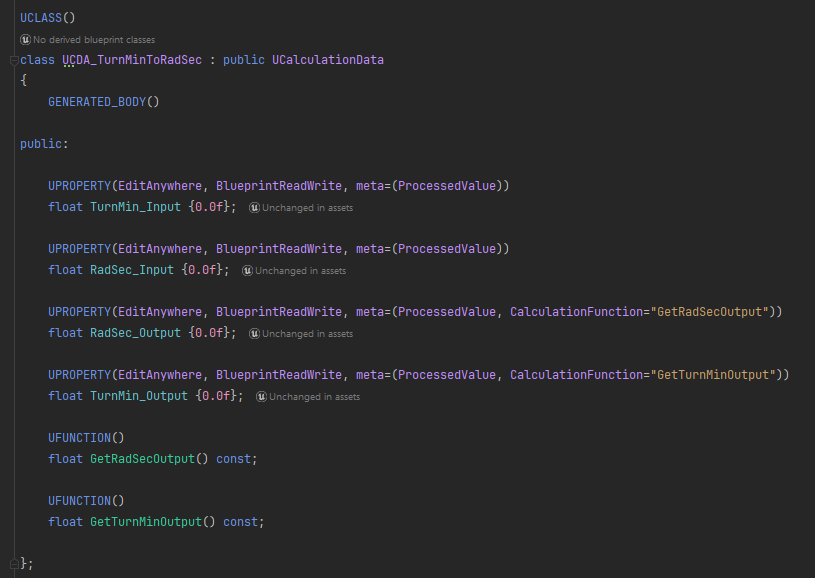
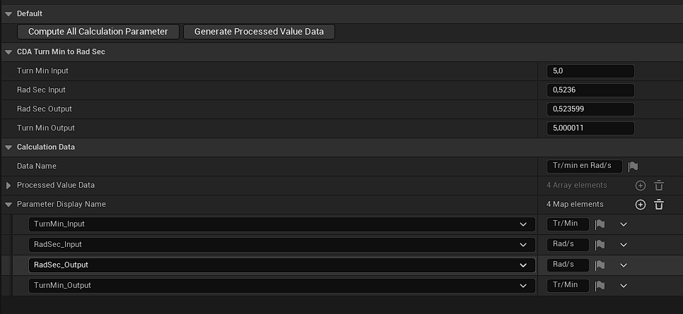
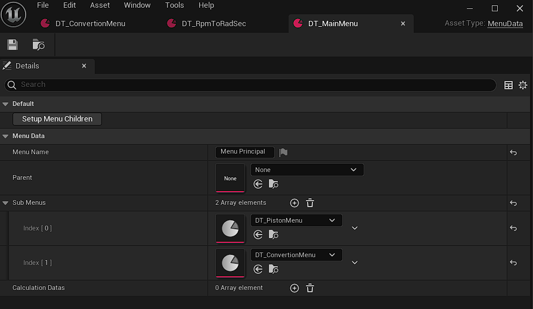
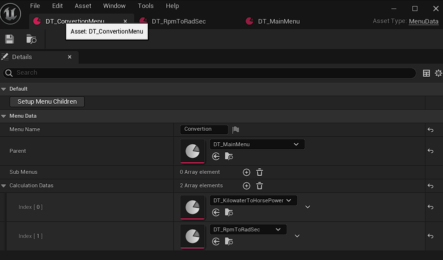
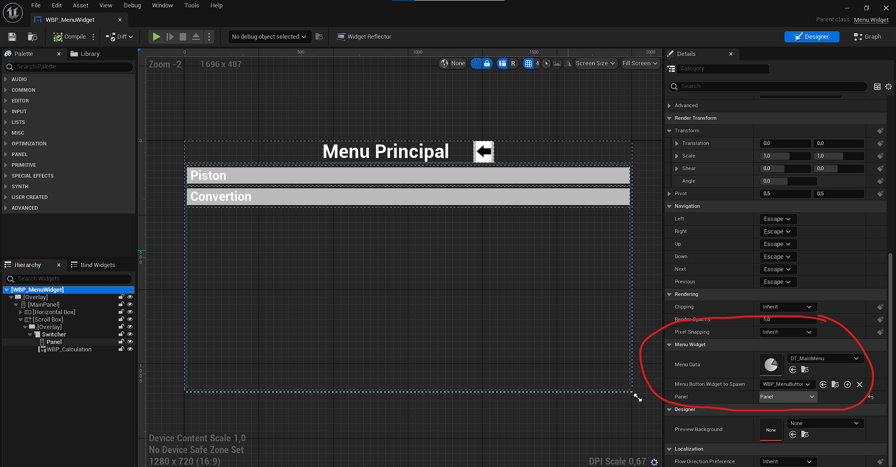
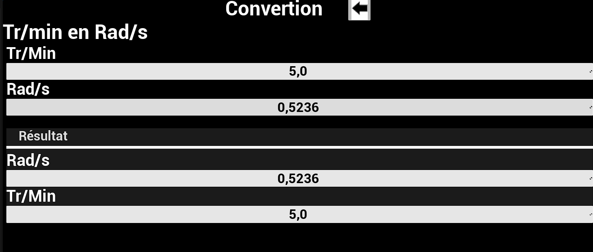

# MecanicCalcApp

A simple over-engeenired app to for pre established calculation.

- I made it to learn how to build for android and as a way to have fun with Unreal properties.
- The project allows to define a class c++ and it will generated a widget to display the calculation for the users.
- It's has I said : Over-engeenired. You probably don't need to go through all the trouble of interpreting class parameters. A simpler version with a custom paramter map would probably do the job as well.
- But hey ! Over-engeeniring is fun !  :D 

# How to use it

## First you create your class
- It has to inherit UCalculationData (which itself inherit from UDataAsset)
- You add "ProccessedValue" in the meta for the paramter to be visible and "CalculationFunction="{YourCppFunction}"" to determine which function will setup its value

    

## Second you create a DataAsset to setup the display parameter
- You create a DataAsset from your created class
- You click on GenerateProcessedValueData
- You do your setup
- You can click on ComputeAllCalculationParamter to check your calculations works

    

## You add the CalculationData to a MenuAsset
- Create the MenuAsset if it's not already done 
- SetupMenuChildren will setup the parent for all the menu in the SubMenu list

    
    

## You make sure you MenuWidget is setup
- You can setup it in different way. Here it's already defined in the parameter for convenience

    

## Magic !

    

